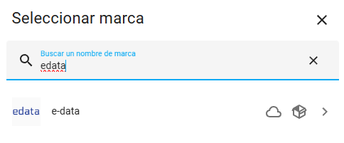
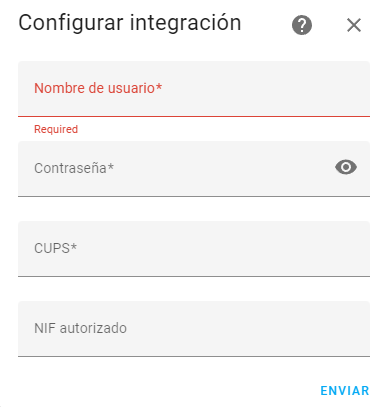
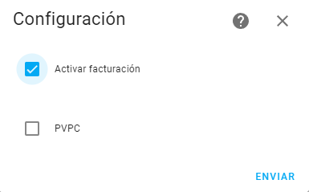
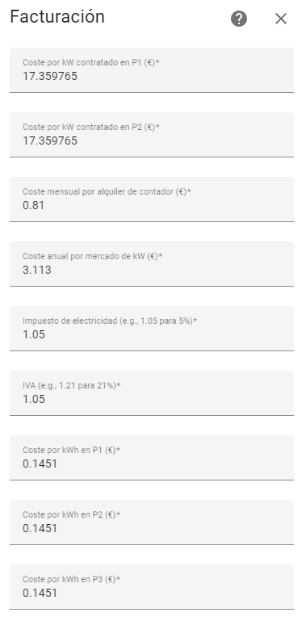
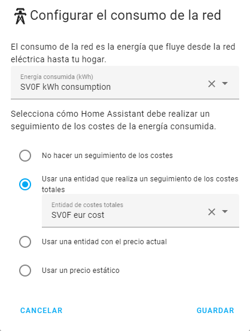

[](https://github.com/custom-components/hacs)

[](https://github.com/uvejota/homeassistant-edata/releases/latest)

# homeassistant-edata


Esta integración para Home Assistant te permite seguir de un vistazo tu consumo, generación y máximas potencias registradas (maxímetro) configurando tu usuario de Datadis. Además ofrece la posibilidad de personalizar reglas de tarificación (desde la versión 2023.01.0).

Para la visualización de los datos, existen varias alternativas:
1. Configurar el Panel de Energía nativo de Home Assistant.
2. Utilizar la tarjeta nativa de esta integración (edata-card).
3. Utilizar tarjetas de terceros (e.g., apexcharts-card). Por su comodidad, se ofrece una API mediante WebSockets para la lectura de los datos.

Ejemplo:


## Limitaciones

* Los datos mostrados **jamás serán en tiempo real**, ya que se saca de la información que registra/factura tu distribuidora y expone a través de la plataforma Datadis. *Siendo optimistas* obtendrás tus datos con al menos dos días de retraso.
* La tarificación de la integración sólo funciona a día de hoy con tarifas 2.0TD si tu tarifa es precio fijo (se permite distinción entre tramos) o PVPC. **NO se incluye tope de gas.**.
* Se depende de la disponibilidad de Datadis, si la API no devuelve datos, no hay NADA que hacer. **Lo que se ve en la Web de Datadis no tiene por qué coincidir con los datos que devuelve la API, son fuentes distintas**

## Instalación

Para instalar esta integración en Home Assistant necesitarás:

* una cuenta funcional (y validada) en la web de [Datadis](https://www.datadis.es)
  * no hay que marcar la casilla de la API al registrar, usaremos la privada que está habilitada por defecto,
* una instalación *reciente* y funcional de Home Assistant (a partir de ahora HA), los componentes `recorder` y `lovelace` disponibles,
* tener o instalar [HACS](https://hacs.xyz/),
* (opcional) tener o instalar el componente [apexchart-card](https://github.com/RomRider/apexcharts-card) (usando HACS) si se quisiera utilizar este método para visualizar los datos.

Una vez satisfecho lo anterior, los pasos a seguir para la instalación son:

1. Añadir este repositorio (<https://github.com/uvejota/homeassistant-edata>) a los repositorios personalizados de HACS,
2. Instalar la integración mediante HACS, y
3. Buscar "edata" en `Configuración > Dispositivos y servicios > Añadir integración`)



5. Configurar sus credenciales de Datadis, indicando el NIF autorizado únicamente si no es el titular del suministro indicado. **Copie y pegue el CUPS** directamente desde la web de Datadis, en mayúscula. Algunas distribuidoras adhieren algunos caracteres adicionales.



6. Esperar unos minutos. Le aparecerá un nuevo sensor llamado `sensor.edata_xxxx` donde `xxxx` dependerá de los últimos cuatro caracteres de su CUPS. En un futuro se podrá elegir el número de dígitos a mostrar, para evitar colisiones si se han configurado muchos suministros.

**NOTA: La instalación puede tardar bastante, ya que la integración "rescata" el último año de consumos desde Datadis, y ésta a veces puede tomarse su tiempo. Periódicamente, la integración solicitará únicamente lo que le falta, en intervalos de 24h.**

## Atributos de la integración

La integración soporta de momento los siguientes atributos:

| Parámetro | Tipo | Unidad | Significado |
| ------------- | ------------- | ------------- | ------------- |
| `cups` | `string` | - | Identificador de su CUPS |
| `contract_p1_kW` | `float` | `kW` | Potencia contratada en P1 en el contrato vigente |
| `contract_p2_kW` | `float` | `kW` | Potencia contratada en P2 en el contrato vigente |
| `yesterday_kWh` | `float` | `kWh` | Consumo total registrado durante el día de ayer |
| `yesterday_p1_kWh` | `float` | `kWh` | Consumo en P1 registrado durante el día de ayer |
| `yesterday_p2_kWh` | `float` | `kWh` | Consumo en P2 registrado durante el día de ayer |
| `yesterday_p3_kWh` | `float` | `kWh` | Consumo en P3 registrado durante el día de ayer |
| `last_day_date` | `date` | `%Y-%m-%d %H:%S` | Último día registrado |
| `last_day_kWh` | `float` | `kWh` | Consumo total registrado durante el último día registrado |
| `last_day_p1_kWh` | `float` | `kWh` | Consumo en P1 registrado durante el último día registrado |
| `last_day_p2_kWh` | `float` | `kWh` | Consumo en P2 registrado durante el último día registrado |
| `last_day_p3_kWh` | `float` | `kWh` | Consumo en P3 registrado durante el último día registrado |
| `month_kWh` | `float` | `kWh` | Consumo total registrado durante el mes en curso (natural) |
| `month_days` | `float` | `d` | Días computados en el mes en curso |
| `month_daily_kWh` | `float` | `kWh` | Consumo medio diario registrado durante el mes en curso |
| `month_p1_kWh` | `float` | `kWh` | Consumo en P1 registrado durante el mes en curso |
| `month_p2_kWh` | `float` | `kWh` | Consumo en P2 registrado durante el mes en curso |
| `month_p3_kWh` | `float` | `kWh` | Consumo en P3 registrado durante el mes en curso |
| `last_month_kWh` | `float` | `kWh` | Consumo total registrado durante el mes pasado (natural) |
| `last_month_days` | `float` | `d` | Días computados en el mes pasado |
| `last_month_daily_kWh` | `float` | `kWh` | Consumo diario registrado durante el mes pasado |
| `last_month_p1_kWh` | `float` | `kWh` | Consumo en P1 registrado durante el mes pasado |
| `last_month_p2_kWh` | `float` | `kWh` | Consumo en P2 registrado durante el mes pasado |
| `last_month_p3_kWh` | `float` | `kWh` | Consumo en P3 registrado durante el mes pasado |
| `max_power_kW` | `float` | `kW` | Máxima potencia registrada en los últimos 12 meses |
| `max_power_date` | `date` | `%Y-%m-%d %H:%S` | Fecha correspondiente a la máxima potencia registrada en los últimos 12 meses |
| `max_power_mean_kW` | `float` | `kW` | Media de las potencias máximas registradas en los últimos 12 meses |
| `max_power_90perc_kW` | `float` | `kW` | Percentil 90 de las potencias máximas registradas en los últimos 12 meses |

## Integración con panel Energía (Long Term Statistics)

A partir de la versión `2022.01.0` de edata, ésta es compatible con las estadísticas de HA, lo cual habilita su uso en el panel de energía. Por defecto, las estadísticas generadas serán:

| statistic_id | Tipo | Unidad | Significado |
| ------------- | ------------- | ------------- | ------------- |
| `edata:xxxx_consumption` | `sum` | `kWh` | Consumo total |
| `edata:xxxx_p1_consumption` | `sum` | `kWh` | Consumo en P1 |
| `edata:xxxx_p2_consumption` | `sum` | `kWh` | Consumo en P2 |
| `edata:xxxx_p3_consumption` | `sum` | `kWh` | Consumo en P3 |
| `edata:xxxx_surplus` | `sum` | `kWh` | Generación total  (>= `2024.01.0`)|
| `edata:xxxx_p1_surplus` | `sum` | `kWh` | Generación en P1  (>= `2024.01.0`)|
| `edata:xxxx_p2_surplus` | `sum` | `kWh` | Generación en P2  (>= `2024.01.0`)|
| `edata:xxxx_p3_surplus` | `sum` | `kWh` | Generación en P3  (>= `2024.01.0`)|
| `edata:xxxx_maximeter` | `max` | `kW` | Maxímetro (>= `2022.09.0`)|
| `edata:xxxx_p1_maximeter` | `max` | `kW` | Maxímetro en P1 (>= `2022.09.0`)|
| `edata:xxxx_p2_maximeter` | `max` | `kW` | Maxímetro en P2 (>= `2022.09.0`)|
| `edata:xxxx_cost`*  | `float` | `€` | Coste total (>= `2022.09.0`)|
| `edata:xxxx_p1_cost`*  | `float` | `€` | Coste total en P1 (>= `2022.12.4`)|
| `edata:xxxx_p2_cost`*  | `float` | `€` | Coste total en P2 (>= `2022.12.4`)|
| `edata:xxxx_p3_cost`*  | `float` | `€` | Coste total en P3 (>= `2022.12.4`)|
| `edata:xxxx_power_cost`*  | `float` | `€` | Coste (potencia) (>= `2022.09.0`)|
| `edata:xxxx_energy_cost`*  | `float` | `€` | Coste (energía) (>= `2022.09.0`)|
| `edata:xxxx_p1_energy_cost`*  | `float` | `€` | Coste (energía) en P1 (>= `2022.12.4`)|
| `edata:xxxx_p2_energy_cost`*  | `float` | `€` | Coste (energía) en P2 (>= `2022.12.4`)|
| `edata:xxxx_p3_energy_cost`*  | `float` | `€` | Coste (energía) en P3 (>= `2022.12.4`)|

\* Los campos marcados con asterisco no están habilitados por defecto, y se habilitan como indica el siguiente apartado.

## Configurar la tarificación

Navegue hasta `Ajustes > Dispositivos y Servicios > XXXX (edata) - Configurar`. Primero deberá seleccionar si desea activar o no las funciones de facturación, y en caso de utilizar PVPC seleccionará también dicha casilla.



A continuación, tendrá que configurar los costes asociados a cada término (según su contrato).



Una vez configuradas y calculadas (tendrá que esperar un poco), las estadísticas pueden configurarse en el panel de energía en `Ajustes > Paneles de control > Energía > Añadir consumo (Red Eléctrica)`:



## Representación gráfica de los datos (requiere apexcharts-card)

### Informe textual

Puede visualizarlos a modo de informe mediante la siguiente tarjeta, **sustituyendo `xxxx`, en minúscula, cuando sea necesario (dos veces)**:

<details>
<summary>He leído las instrucciones y quiero ver el contenido (hacer click para mostrar)</summary>

``` yaml
type: markdown
content: >
    **{{attr}}**: {{state_attr("sensor.edata_xxxx", attr)}} {{-
  '\n' -}}  
title: Informe
```

</details>

### Definición de nuevos sensores a partir de los atributos

También puedes extraer uno de los atributos como un sensor aparte siguiendo el siguiente ejemplo (por [@thekimera](https://github.com/thekimera)):

<details>
<summary>He leído las instrucciones y quiero ver el contenido</summary>

``` yaml
sensor:
  - platform: template
    sensors:
      last_month_consumption:
        friendly_name: "Consumo mes anterior"
        value_template: >-
           {{ state_attr('sensor.edata_xxxx', 'last_month_kWh') | float }}
        unit_of_measurement: kWh
```

</details>

A continuación se ofrecen una serie de tarjetas (en yaml) que permiten **visualizar los datos obtenidos mediante gráficas interactivas generadas con un componente llamado apexcharts-card**, que también debe instalarse manualmente o mediante HACS. Siga las instrucciones de <https://github.com/RomRider/apexcharts-card> y recuerde tener el repositorio a mano para personalizar las gráficas a continuación.

**NOTA: en las siguientes tarjetas deberá reemplazar TODAS las ocurrencias de `xxxx` por sus últimos cuatro caracteres de su CUPS**.

### Consumo diario


<details>
<summary>He leído las instrucciones y quiero ver el contenido</summary>

``` yaml
type: custom:apexcharts-card
graph_span: 30d
stacked: true
span:
  offset: '-1d'
experimental:
  brush: true
header:
  show: true
  title: Consumo diario
  show_states: false
  colorize_states: false
brush:
  selection_span: 10d
all_series_config:
  type: column
  unit: kWh
  show:
    legend_value: false
series:
  - entity: sensor.edata_xxxx
    name: Total
    type: column
    data_generator: |
      return hass.connection.sendMessagePromise({
      type: 'edata/consumptions/daily',
      scups: 'xxxx'}).then(
          (resp) => {
              return resp.map((data, index) => {
                return [new Date(data['datetime']).getTime(), data['value_kWh']];
              });
          }
      );
    show:
      in_chart: false
      in_brush: true
  - entity: sensor.edata_xxxx
    name: Punta
    data_generator: |
      return hass.connection.sendMessagePromise({
      type: 'edata/consumptions/daily',
      scups: 'xxxx'}).then(
          (resp) => {
              return resp.map((data, index) => {
                return [new Date(data['datetime']).getTime(), data['value_p1_kWh']];
              });
          }
      );
  - entity: sensor.edata_xxxx
    name: Llano
    data_generator: |
      return hass.connection.sendMessagePromise({
      type: 'edata/consumptions/daily',
      scups: 'xxxx'}).then(
          (resp) => {
              return resp.map((data, index) => {
                return [new Date(data['datetime']).getTime(), data['value_p2_kWh']];
              });
          }
      );
  - entity: sensor.edata_xxxx
    name: Valle
    data_generator: |
      return hass.connection.sendMessagePromise({
      type: 'edata/consumptions/daily',
      scups: 'xxxx'}).then(
          (resp) => {
              return resp.map((data, index) => {
                return [new Date(data['datetime']).getTime(), data['value_p3_kWh']];
              });
          }
      );
```

</details>

### Consumo mensual


<details>
<summary>He leído las instrucciones y quiero ver el contenido</summary>

``` yaml
type: custom:apexcharts-card
graph_span: 395d
stacked: true
yaxis:
  - id: eje
    opposite: false
    max: '|+20|'
    min: ~0
    apex_config:
      forceNiceScale: true
header:
  show: true
  title: Consumo mensual
  show_states: false
  colorize_states: false
all_series_config:
  type: column
  unit: kWh
  yaxis_id: eje
  extend_to: false
  show:
    legend_value: false
series:
  - entity: sensor.edata_xxxx
    type: line
    name: Total
    data_generator: |
      return hass.connection.sendMessagePromise({
      type: 'edata/consumptions/monthly',
      scups: 'xxxx'}).then(
          (resp) => {
              return resp.map((data, index) => {
                return [new Date(data['datetime']).getTime(), data['value_kWh']];
              });
          }
      );
    show:
      in_chart: true
  - entity: sensor.edata_xxxx
    name: Punta
    data_generator: |
      return hass.connection.sendMessagePromise({
      type: 'edata/consumptions/monthly',
      scups: 'xxxx'}).then(
          (resp) => {
              return resp.map((data, index) => {
                return [new Date(data['datetime']).getTime(), data['value_p1_kWh']];
              });
          }
      );
  - entity: sensor.edata_xxxx
    name: Llano
    data_generator: |
      return hass.connection.sendMessagePromise({
      type: 'edata/consumptions/monthly',
      scups: 'xxxx'}).then(
          (resp) => {
              return resp.map((data, index) => {
                return [new Date(data['datetime']).getTime(), data['value_p2_kWh']];
              });
          }
      );
  - entity: sensor.edata_xxxx
    name: Valle
    data_generator: |
      return hass.connection.sendMessagePromise({
      type: 'edata/consumptions/monthly',
      scups: 'xxxx'}).then(
          (resp) => {
              return resp.map((data, index) => {
                return [new Date(data['datetime']).getTime(), data['value_p3_kWh']];
              });
          }
      );
```

</details>

### Maxímetro


<details>
<summary>He leído las instrucciones y quiero ver el contenido</summary>

``` yaml
type: custom:apexcharts-card
graph_span: 1y
span:
  offset: '-30d'
header:
  show: true
  title: Maxímetro
  show_states: false
  colorize_states: false
chart_type: scatter
series:
  - entity: sensor.edata_xxxx
    name: Potencia máxima
    type: column
    extend_to: false
    unit: kW
    show:
      extremas: true
      datalabels: false
    data_generator: |
      return hass.connection.sendMessagePromise({
      type: 'edata/maximeter',
      scups: 'xxxx'}).then(
          (resp) => {
              return resp.map((data, index) => {
                return [new Date(data['datetime']).getTime(), data['value_kW']];
              });
          }
      );

```

</details>

### Detalle: ayer


<details>
<summary>He leído las instrucciones y quiero ver el contenido</summary>

``` yaml
type: custom:apexcharts-card
chart_type: pie
header:
  show: true
  title: Ayer
  show_states: true
  colorize_states: true
  floating: true
all_series_config:
  unit: kWh
  show:
    legend_value: true
    in_header: false
apex_config:
  chart:
    height: 250px
series:
  - entity: sensor.edata_xxxx
    attribute: yesterday_kWh
    show:
      in_chart: false
      in_header: true
    name: Total
  - entity: sensor.edata_xxxx
    attribute: yesterday_p1_kWh
    name: Punta
  - entity: sensor.edata_xxxx
    attribute: yesterday_p2_kWh
    name: Llano
  - entity: sensor.edata_xxxx
    attribute: yesterday_p3_kWh
    name: Valle
```

</details>

### Detalle: mes en curso


<details>
<summary>He leído las instrucciones y quiero ver el contenido</summary>

``` yaml
type: custom:apexcharts-card
chart_type: pie
header:
  show: true
  title: Mes en curso
  show_states: true
  colorize_states: true
  floating: true
all_series_config:
  show:
    legend_value: true
    in_header: false
  unit: kWh
apex_config:
  chart:
    height: 250px
series:
  - entity: sensor.edata_xxxx
    attribute: month_kWh
    show:
      in_chart: false
      in_header: true
    name: Total
  - entity: sensor.edata_xxxx
    attribute: month_p1_kWh
    name: Punta
  - entity: sensor.edata_xxxx
    attribute: month_p2_kWh
    name: Llano
  - entity: sensor.edata_xxxx
    attribute: month_p3_kWh
    name: Valle
  - entity: sensor.edata_xxxx
    attribute: month_€
    unit: €
    show:
      in_chart: false
      in_header: true
    name: Factura
```

</details>

### Detalle: mes anterior


<details>
<summary>He leído las instrucciones y quiero ver el contenido</summary>

``` yaml
type: custom:apexcharts-card
chart_type: pie
header:
  show: true
  title: Mes pasado
  show_states: true
  colorize_states: true
  floating: true
all_series_config:
  show:
    legend_value: true
    in_header: false
  unit: kWh
apex_config:
  chart:
    height: 250px
series:
  - entity: sensor.edata_xxxx
    attribute: last_month_kWh
    show:
      in_chart: false
      in_header: true
    name: Total
  - entity: sensor.edata_xxxx
    attribute: last_month_p1_kWh
    name: Punta
  - entity: sensor.edata_xxxx
    attribute: last_month_p2_kWh
    name: Llano
  - entity: sensor.edata_xxxx
    attribute: last_month_p3_kWh
    name: Valle
  - entity: sensor.edata_xxxx
    attribute: last_month_€
    unit: €
    show:
      in_chart: false
      in_header: true
    name: Factura
```

</details>

## FAQ

**¿Por qué no me funciona?**

>Hermosa pregunta:
>
>0. Si no ve los datos en datadis.es, no los verá aquí, trate de solucionar primero lo anterior. Si no ha leído o seguido las instrucciones, hágalo.
>1. Si no se ha creado el sensor `sensor.edata_xxxx`, algo ha fallado y posiblemente sea una mala configuración del sensor, revise el log y siga las instrucciones.
>2. Si el sensor se ha creado, pero sólo el atributo CUPS está relleno, es posible que Datadis no esté operativo en ese instante, deje la integración funcionando y se recuperará sola.
>3. Si el sensor se ha creado, y el atributo CUPS no está relleno, ha debido introducir erróneamente (a) sus credenciales, (b) su CUPS. Copie y pegue todos los datos anteriores desde la web de Datadis.es. Insisto, copie y pegue, algunas distribuidoras ofrecen un número de CUPS con dos dígitos adicionales que no coinciden con el de Datadis.
>4. Si no tiene idea de qué ocurre, puede habilitar logs de mayor detalle añadiendo lo siguiente al fichero `configuration.yaml`:
>``` yaml
>sensor:
>  - platform: edata
>    debug: true
>```
>
>Si nada de lo anterior funciona, cree una *issue* en <https://github.com/uvejota/homeassistant-edata/issues>, indicando versión, sintomatología y aportando los logs del paciente, y trataré de ayudarle lo antes posible.

**¿Por qué hay huecos en mis datos?**

>Respuesta corta: porque la API de datadis no te ha dado esos datos.
>
>Respuesta larga: porque la API de datadis es impredecible y a veces responde datos vacíos `[]`, o códigos `50X`.
>
>Lo mejor que puedes hacer es esperar, sé que quieres ver tus datos ya, pero confía en mí, recargar la integración o reiniciar HA sólo va a conseguir que saturemos la API de Datadis. La integración está preparada para consultar cada hora (lo cual me parece más que razonable) los datos que le faltan completando los huecos. Cuanto más datos te faltan (e.g., primera ejecución), más tarda.


**El panel de energía me muestra huecos o consumos duplicados, pero las tarjetas de apexcharts no**

>Desde la versión `2022.09.0`, puedes regenerar las estadísticas manualmente mediante un servicio (`Herramientas para desarrolladores > Servicios > edata.recreate_statistics`).
