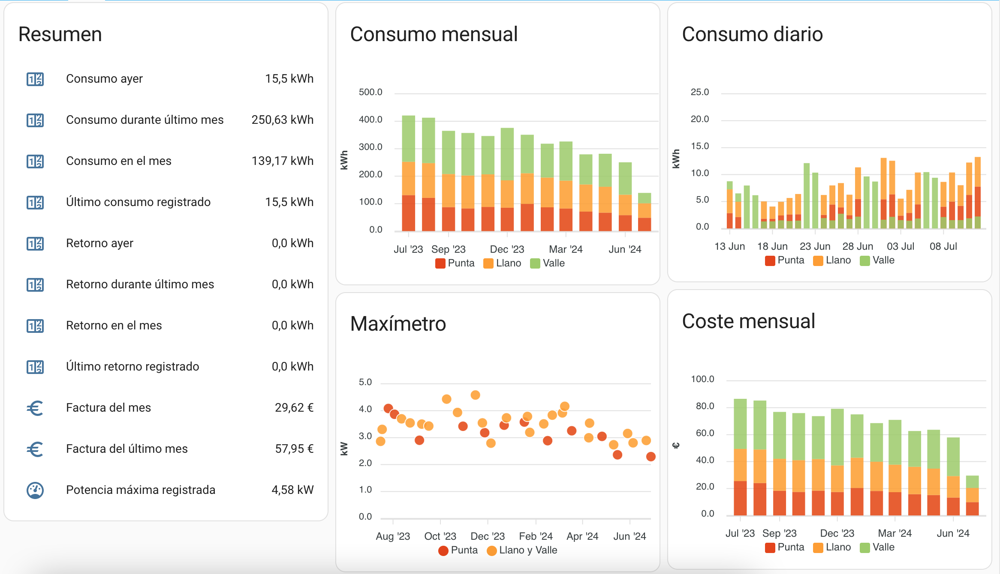
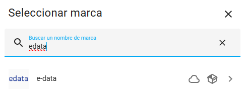
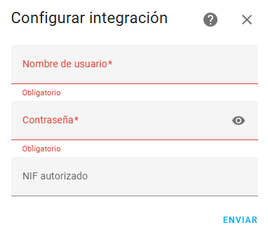
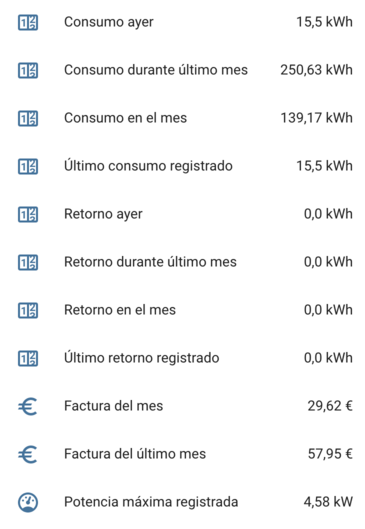
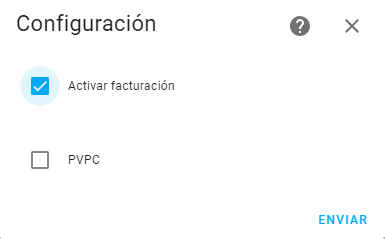
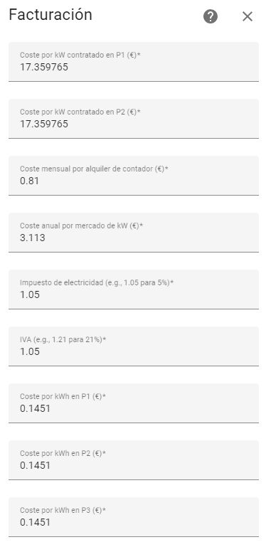
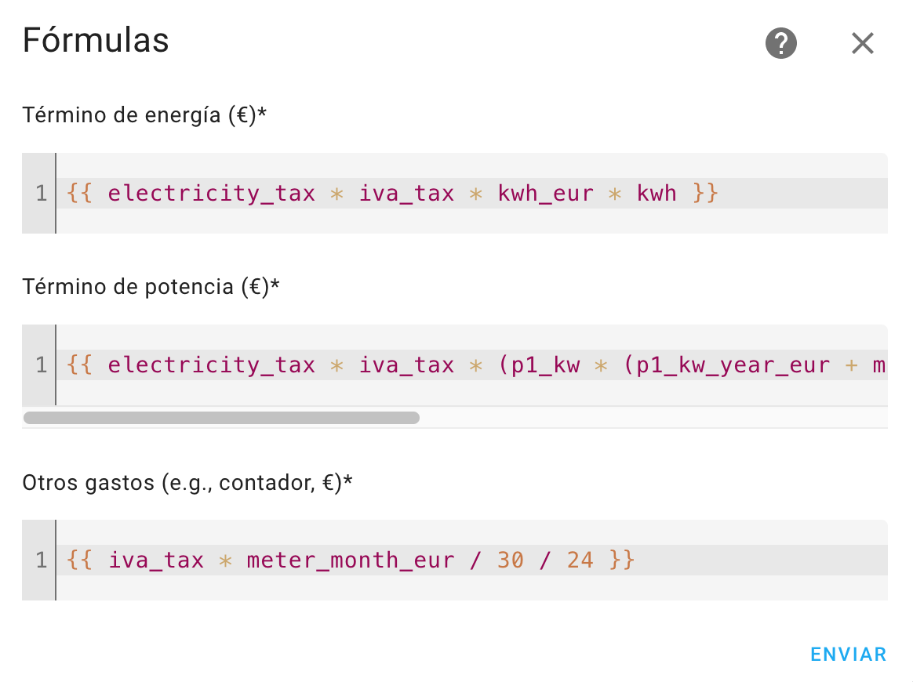
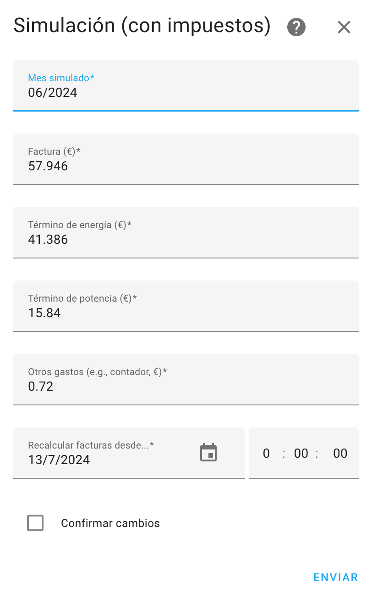
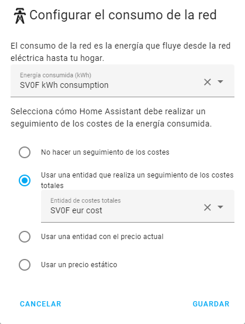
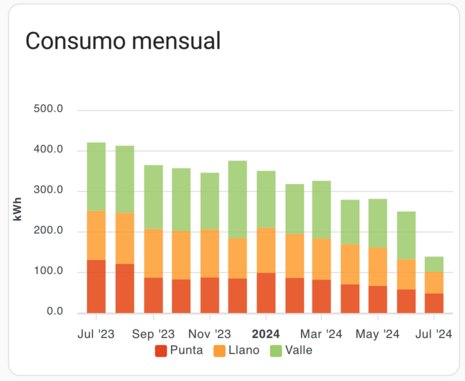

[](https://github.com/custom-components/hacs)

[](https://github.com/uvejota/homeassistant-edata/releases/latest)

# homeassistant-edata


Esta integración para Home Assistant te permite seguir de un vistazo tu consumo, generación y máximas potencias registradas (maxímetro) configurando tu usuario de Datadis.

Para la visualización de los datos, existen varias alternativas:
1. Configurar el Panel de Energía nativo de Home Assistant.
2. Utilizar la tarjeta nativa de esta integración (edata-card). **RECOMENDADO, CONFIGURACIÓN SENCILLA.**
3. Utilizar tarjetas de terceros (e.g., apexcharts-card) que consume los datos de la integración por Websockets. **Para los más cafeteros...**

## Ejemplo de Dashboard

### Ejemplo con tarjeta nativa:



### Ejemplo con apexcharts-card:


## Limitaciones

* Los datos mostrados **jamás serán en tiempo real**, ya que se saca de la información que registra/factura tu distribuidora y expone a través de la plataforma Datadis. *Siendo optimistas* obtendrás tus datos con al menos dos días de retraso.
* Las opciones de tarificación para **estimar** la factura, quedan limitadas a tarifas 2.0TD PVPC, o precio fijo con distinción de tres tramos: punta, llano y valle. La tarificación del retorno NO está disponible aún.
* Se depende de la disponibilidad de Datadis, si la API no devuelve datos, no hay NADA que hacer. **Lo que se ve en la Web de Datadis no tiene por qué coincidir con los datos que devuelve la API, son fuentes distintas**

## Instalación

Para instalar esta integración en Home Assistant necesitarás:

* una cuenta funcional (y validada) en la web de [Datadis](https://www.datadis.es)
  * no hay que marcar la casilla de la API al registrar, usaremos la privada que está habilitada por defecto,
* una instalación *reciente* y funcional de Home Assistant (a partir de ahora HA), los componentes `recorder` y `lovelace` deben estar disponibles (lo están por defecto),
* instalar [HACS](https://hacs.xyz/),
* (opcional) instalar el componente [apexchart-card](https://github.com/RomRider/apexcharts-card) (usando HACS) si se quisiera utilizar este método para visualizar los datos.

Una vez satisfecho lo anterior, los pasos a seguir para la instalación son:

1. Añadir este repositorio (<https://github.com/uvejota/homeassistant-edata>) a los repositorios personalizados de HACS,
2. Instalar la integración mediante HACS, y
3. Buscar "edata" en `Configuración > Dispositivos y servicios > Añadir integración`



4. Configurar sus credenciales de Datadis, indicando el NIF autorizado únicamente si no es el titular del suministro indicado. **Copie y pegue el CUPS** directamente desde la web de Datadis, en mayúscula. Algunas distribuidoras adhieren algunos caracteres adicionales.



> **IMPORTANTE:** El último campo (NIF autorizado) hay que dejarlo vacío si eres el titular del CUPS. Está pensado para poder ceder el acceso a tus datos a una tercera persona.

5. Esperar unos minutos. Le aparecerá un nuevo sensor dispositivo, que consta de un sensor principal llamado `sensor.edata_xxxx` donde `xxxx` dependerá de los últimos caracteres de su CUPS, y de otros sensores con los datos.

> **NOTA:** La instalación puede tardar bastante en su primera ejecución, ya que la integración "rescata" el último año de consumos desde Datadis, y ésta a veces puede tomarse su tiempo. Periódicamente, la integración solicitará únicamente lo que le falta, en intervalos de 24h.

## Sensores de la integración

La integración ofrece los sensores de la figura. Cada sensor dispone de una serie de atributos visibles al pinchar, por ejemplo indicando qué parte del consumo se ha registrado en P1, P2, y P3.



## Integración con panel Energía (Long Term Statistics)

La integración combina almacenamiento local (en ficheros), con la base de datos de estadísticas nativa de Home Assistant, lo cual habilita su uso en el panel de energía. Por defecto, las estadísticas generadas serán:

| statistic_id | Tipo | Unidad | Significado |
| ------------- | ------------- | ------------- | ------------- |
| `edata:xxxx_consumption` | `sum` | `kWh` | Consumo total |
| `edata:xxxx_p1_consumption` | `sum` | `kWh` | Consumo en P1 |
| `edata:xxxx_p2_consumption` | `sum` | `kWh` | Consumo en P2 |
| `edata:xxxx_p3_consumption` | `sum` | `kWh` | Consumo en P3 |
| `edata:xxxx_surplus` | `sum` | `kWh` | Generación total  (>= `2024.07.0`)|
| `edata:xxxx_maximeter` | `max` | `kW` | Maxímetro (>= `2022.09.0`)|
| `edata:xxxx_p1_maximeter` | `max` | `kW` | Maxímetro en P1 (>= `2022.09.0`)|
| `edata:xxxx_p2_maximeter` | `max` | `kW` | Maxímetro en P2 (>= `2022.09.0`)|
| `edata:xxxx_cost`*  | `float` | `€` | Coste total (>= `2022.09.0`)|
| `edata:xxxx_p1_cost`*  | `float` | `€` | Coste total en P1 (>= `2022.12.4`)|
| `edata:xxxx_p2_cost`*  | `float` | `€` | Coste total en P2 (>= `2022.12.4`)|
| `edata:xxxx_p3_cost`*  | `float` | `€` | Coste total en P3 (>= `2022.12.4`)|
| `edata:xxxx_power_cost`*  | `float` | `€` | Coste (potencia) (>= `2022.09.0`)|
| `edata:xxxx_energy_cost`*  | `float` | `€` | Coste (energía) (>= `2022.09.0`)|
| `edata:xxxx_p1_energy_cost`*  | `float` | `€` | Coste (energía) en P1 (>= `2022.12.4`)|
| `edata:xxxx_p2_energy_cost`*  | `float` | `€` | Coste (energía) en P2 (>= `2022.12.4`)|
| `edata:xxxx_p3_energy_cost`*  | `float` | `€` | Coste (energía) en P3 (>= `2022.12.4`)|

\* Los campos marcados con asterisco no están habilitados por defecto, y se habilitan como indica el siguiente apartado.

## Configurar la tarificación

Navegue hasta `Ajustes > Dispositivos y Servicios > XXXX (edata) - Configurar`. Primero deberá seleccionar si desea activar o no las funciones de facturación, y en caso de utilizar PVPC seleccionará también dicha casilla.

1. Activar la facturación y/o PVPC.



2. Si no ha activado PVPC, tendrá que configurar los costes asociados a cada término (según su contrato).



3. Personalización de fórmulas con expresiones jinja2. Tendrá que adaptar la fórmula según su tipología de contrato.

Las variables disponibles son las configuradas en el paso anterior y los consumos del periodo a tarificar, pero con los siguientes nombres:
* `electricity_tax`: impuesto a la electricidad (e.g. 1.05 para el 5%)
* `iva_tax`: IVA (e.g., 1.21 para 21%)
* `kwh_eur`: coste del kWh en euros para la hora del consumo (se escoge automáticamente entre p1, p2, y p3; según convenga)
* `kwh`: energía consumida en kWh
* `p1_kw` y `p2_kw`: potencia contratada en P1 y P2 (en kW)
* `p1_kw_year_eur` y `p2_kw_year_eur`: Coste de la potencia por kW en P1 y P2 (en euros y anual)
* `market_kw_year_eur`: Coste anual por mercado de kW
* `meter_month_eur`: Coste del alquiler del contador en euros al mes

Las variables anteriores pueden usarse para formar expresiones para los siguientes términos: energía, potencia y otros. No olvides contemplar el IVA. Puedes utilizar la que viene por defecto como base.

> **NOTA 1:** ¡Siempre en minúscula!

> **NOTA 2:** ¡No elimines las llaves del principio y final!

> **NOTA 3:** El retorno o batería virtual aún no está soportado.



4. Simulación del último mes y selección de la fecha de inicio para aplicar nueva tarificación.

Este último paso es para confirmar que hemos confeccionado nuestras fórmulas correctamente. Es un simulador del último mes completo (si estás a mediados de julio, calculará junio), de modo que si se acerca a la de tu factura... ¡Lo has hecho bien!

No hay que rellenar nada, sólo visualizar, marcar la fecha desde la cual quieres aplicar los cambios de tarificación, y confirmar.



Una vez configuradas y calculadas (tendrá que esperar un poco), las estadísticas pueden configurarse en el panel de energía en `Ajustes > Paneles de control > Energía > Añadir consumo (Red Eléctrica)`:



> **NOTA:** Esta integración hace un uso _gracioso_ del panel de estadísticas de Home Assistant que, aunque lo permite, no está totalmente preparado para manipular estadísticas a pasado.

## Gráficas nativas

Se ofrecen una serie de tarjetas nativas que simplifican significativamente la configuración. Por ejemplo:



Cuya configuración en YAML es la siguiente.

```yaml
title: Consumo mensual # título de tu tarjeta
type: custom:edata-card
chart: consumptions # opciones: consumptions, costs, maximeter
entity: sensor.edata_xxxx # el id de tu sensor principal
aggr: month # opciones: hour, day, month
records: 12 # número de registros
colors: # opcional, para cambiar los colores
  - '#e54304'
  - '#ff9e22'
  - '#9CCC65'
```

> **NOTA:** en futuras versiones se contempla ampliar y mejorar las funcionalidades de la tarjeta.

## Gráficas basadas en apexcharts-card

A continuación se ofrecen una serie de tarjetas (en yaml) que permiten **visualizar los datos obtenidos mediante gráficas interactivas generadas con un componente llamado apexcharts-card**, que también debe instalarse manualmente o mediante HACS. Siga las instrucciones de <https://github.com/RomRider/apexcharts-card> y recuerde tener el repositorio a mano para personalizar las gráficas a continuación.

**NOTA: en las siguientes tarjetas deberá reemplazar TODAS las ocurrencias de `xxxx` por sus últimos cuatro caracteres de su CUPS**.

### Consumo diario


<details>
<summary>He leído las instrucciones y quiero ver el contenido</summary>

``` yaml
type: custom:apexcharts-card
graph_span: 30d
stacked: true
span:
  offset: '-1d'
experimental:
  brush: true
header:
  show: true
  title: Consumo diario
  show_states: false
  colorize_states: false
brush:
  selection_span: 10d
all_series_config:
  type: column
  unit: kWh
  show:
    legend_value: false
series:
  - entity: sensor.edata_xxxx
    name: Total
    type: column
    data_generator: |
      return hass.connection.sendMessagePromise({
      type: 'edata/consumptions/daily',
      scups: 'xxxx'}).then(
          (resp) => {
              return resp.map((data, index) => {
                return [new Date(data['datetime']).getTime(), data['value_kWh']];
              });
          }
      );
    show:
      in_chart: false
      in_brush: true
  - entity: sensor.edata_xxxx
    name: Punta
    stack_group: "1"
    data_generator: |
      return hass.connection.sendMessagePromise({
      type: 'edata/consumptions/daily',
      scups: 'xxxx'}).then(
          (resp) => {
              return resp.map((data, index) => {
                return [new Date(data['datetime']).getTime(), data['value_p1_kWh']];
              });
          }
      );
  - entity: sensor.edata_xxxx
    name: Llano
    stack_group: "1"
    data_generator: |
      return hass.connection.sendMessagePromise({
      type: 'edata/consumptions/daily',
      scups: 'xxxx'}).then(
          (resp) => {
              return resp.map((data, index) => {
                return [new Date(data['datetime']).getTime(), data['value_p2_kWh']];
              });
          }
      );
  - entity: sensor.edata_xxxx
    name: Valle
    stack_group: "1"
    data_generator: |
      return hass.connection.sendMessagePromise({
      type: 'edata/consumptions/daily',
      scups: 'xxxx'}).then(
          (resp) => {
              return resp.map((data, index) => {
                return [new Date(data['datetime']).getTime(), data['value_p3_kWh']];
              });
          }
      );
```

</details>

### Consumo mensual


<details>
<summary>He leído las instrucciones y quiero ver el contenido</summary>

``` yaml
type: custom:apexcharts-card
graph_span: 395d
stacked: true
yaxis:
  - id: eje
    opposite: false
    max: '|+20|'
    min: ~0
    apex_config:
      forceNiceScale: true
header:
  show: true
  title: Consumo mensual
  show_states: false
  colorize_states: false
all_series_config:
  type: column
  yaxis_id: eje
  unit: kWh
  extend_to: false
  show:
    legend_value: false
series:
  - entity: sensor.edata_xxxx
    type: line
    name: Total
    data_generator: |
      return hass.connection.sendMessagePromise({
      type: 'edata/ws/consumptions',
      scups: 'xxxx',
      aggr: 'month',
      records: 12});
    show:
      in_chart: true
  - entity: sensor.edata_xxxx
    name: Punta
    stack_group: "1"
    data_generator: |
      return hass.connection.sendMessagePromise({
      type: 'edata/ws/consumptions',
      scups: 'xxxx',
      aggr: 'month',
      tariff: 'p1',
      records: 12});
  - entity: sensor.edata_xxxx
    name: Llano
    stack_group: "1"
    data_generator: |
      return hass.connection.sendMessagePromise({
      type: 'edata/ws/consumptions',
      scups: 'xxxx',
      aggr: 'month',
      tariff: 'p2',
      records: 12});
  - entity: sensor.edata_xxxx
    name: Valle
    stack_group: "1"
    data_generator: |
      return hass.connection.sendMessagePromise({
      type: 'edata/ws/consumptions',
      scups: 'xxxx',
      aggr: 'month',
      tariff: 'p3',
      records: 12});
```

</details>

### Maxímetro


<details>
<summary>He leído las instrucciones y quiero ver el contenido</summary>

``` yaml
type: custom:apexcharts-card
graph_span: 1y
span:
  offset: '-15d'
header:
  show: true
  title: Maxímetro
  show_states: false
  colorize_states: false
chart_type: scatter
series:
  - entity: sensor.edata_xxxx
    type: column
    extend_to: false
    name: Punta
    show:
      extremas: true
      datalabels: false
    data_generator: |
      return hass.connection.sendMessagePromise({
      type: 'edata/ws/maximeter',
      tariff: 'p1',
      scups: 'xxxx'});
  - entity: sensor.edata_xxxx
    type: column
    extend_to: false
    name: Llano y Valle
    show:
      extremas: true
      datalabels: false
    data_generator: |
      return hass.connection.sendMessagePromise({
      type: 'edata/ws/maximeter',
      tariff: 'p2',
      scups: 'xxxx'});
```

</details>

### Detalle: último día registrado


<details>
<summary>He leído las instrucciones y quiero ver el contenido</summary>

```yaml
type: custom:apexcharts-card
chart_type: pie
header:
  show: true
  title: Último día registrado
  show_states: true
  colorize_states: true
  floating: true
all_series_config:
  unit: kWh
  show:
    legend_value: true
    in_header: false
apex_config:
  chart:
    height: 250px
series:
  - entity: sensor.xxxx_ultimo_consumo_registrado
    attribute: last_registered_day_kWh
    show:
      in_chart: false
      in_header: true
    name: Total
  - entity: sensor.xxxx_ultimo_consumo_registrado
    attribute: last_registered_day_p1_kWh
    name: Punta
  - entity: sensor.xxxx_ultimo_consumo_registrado
    attribute: last_registered_day_p2_kWh
    name: Llano
  - entity: sensor.xxxx_ultimo_consumo_registrado
    attribute: last_registered_day_p3_kWh
    name: Valle
  - entity: sensor.xxxx_ultimo_consumo_registrado
    name: Día del mes
    unit: ''
    show:
      in_chart: false
      in_header: true
```

</details>

### Detalle: mes en curso


<details>
<summary>He leído las instrucciones y quiero ver el contenido</summary>

``` yaml
type: custom:apexcharts-card
chart_type: pie
header:
  show: true
  title: Mes en curso
  show_states: true
  colorize_states: true
  floating: true
all_series_config:
  show:
    legend_value: true
    in_header: false
  unit: kWh
apex_config:
  chart:
    height: 250px
series:
  - entity: sensor.xxxx_consumo_en_el_mes
    show:
      in_chart: false
      in_header: true
    name: Total
  - entity: sensor.xxxx_consumo_en_el_mes
    attribute: month_p1_kWh
    name: Punta
  - entity: sensor.xxxx_consumo_en_el_mes
    attribute: month_p2_kWh
    name: Llano
  - entity: sensor.xxxx_consumo_en_el_mes
    attribute: month_p3_kWh
    name: Valle
  - entity: sensor.xxxx_factura_del_mes
    name: Facturación
    show:
      in_chart: false
      in_header: true
    unit: €
```

</details>

### Detalle: mes anterior


<details>
<summary>He leído las instrucciones y quiero ver el contenido</summary>

``` yaml
type: custom:apexcharts-card
chart_type: pie
header:
  show: true
  title: Mes pasado
  show_states: true
  colorize_states: true
  floating: true
all_series_config:
  show:
    legend_value: true
    in_header: false
  unit: kWh
apex_config:
  chart:
    height: 250px
series:
  - entity: sensor.xxxx_consumo_durante_ultimo_mes
    show:
      in_chart: false
      in_header: true
    name: Total
  - entity: sensor.xxxx_consumo_durante_ultimo_mes
    attribute: last_month_p1_kWh
    name: Punta
  - entity: sensor.xxxx_consumo_durante_ultimo_mes
    attribute: last_month_p2_kWh
    name: Llano
  - entity: sensor.xxxx_consumo_durante_ultimo_mes
    attribute: last_month_p3_kWh
    name: Valle
  - entity: sensor.xxxx_factura_del_ultimo_mes
    name: Facturación
    show:
      in_chart: false
      in_header: true
    unit: €
```

</details>

## FAQ

**¿Por qué no me funciona?**

>Hermosa pregunta:
>
>0. Si no ve los datos en datadis.es, no los verá aquí, trate de solucionar primero lo anterior. Si no ha leído o seguido las instrucciones, hágalo.
>1. Si no se ha creado el sensor `sensor.edata_xxxx`, algo ha fallado y posiblemente sea una mala configuración del sensor, revise el log y siga las instrucciones.
>2. Si el sensor se ha creado, pero sólo el atributo CUPS está relleno, es posible que Datadis no esté operativo en ese instante, deje la integración funcionando y se recuperará sola.
>3. Si el sensor se ha creado, y el atributo CUPS no está relleno, ha debido introducir erróneamente (a) sus credenciales, (b) su CUPS. Copie y pegue todos los datos anteriores desde la web de Datadis.es. Insisto, copie y pegue, algunas distribuidoras ofrecen un número de CUPS con dos dígitos adicionales que no coinciden con el de Datadis.
>4. Si no tiene idea de qué ocurre, puede habilitar la depuración en la configuración del dispositivo.
>Si nada de lo anterior funciona, cree una *issue* en <https://github.com/uvejota/homeassistant-edata/issues>, indicando versión, sintomatología y aportando los logs del paciente, y trataré de ayudarle lo antes posible.

**¿Por qué hay huecos en mis datos?**

>Respuesta corta: porque la API de datadis no te ha dado esos datos.
>
>Respuesta larga: porque la API de datadis es impredecible y a veces responde datos vacíos `[]`, o códigos `50X`.
>
>Lo mejor que puedes hacer es esperar, sé que quieres ver tus datos ya, pero confía en mí, recargar la integración o reiniciar HA sólo va a conseguir que saturemos la API de Datadis. La integración está preparada para consultar cada hora (lo cual me parece más que razonable) los datos que le faltan completando los huecos. Cuanto más datos te faltan (e.g., primera ejecución), más tarda.


**Veo huecos o consumos duplicados**

>Desde la versión `2022.09.0`, puedes regenerar las estadísticas manualmente mediante un servicio (`Herramientas para desarrolladores > Servicios > edata.recreate_statistics`).
