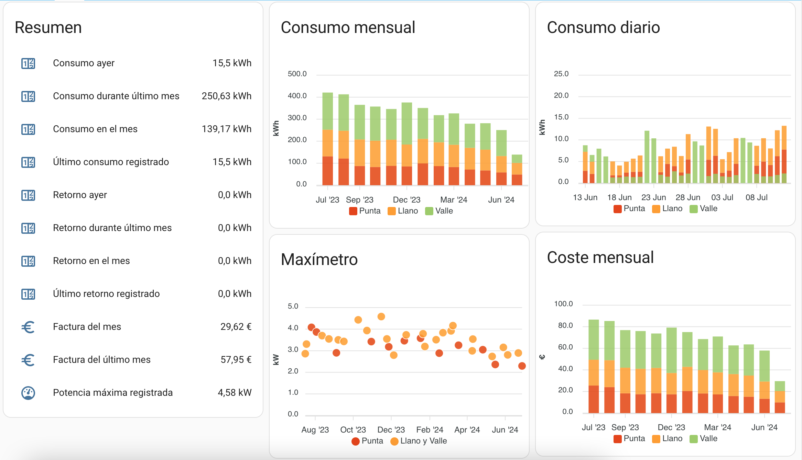
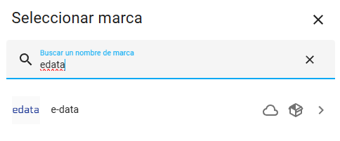
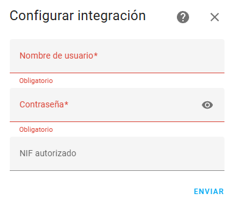
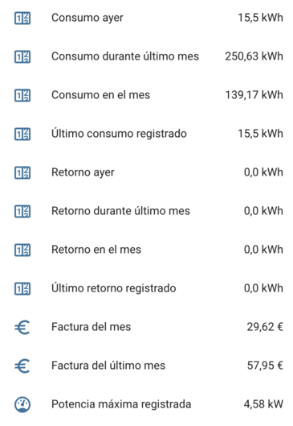
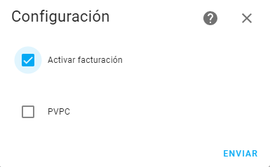
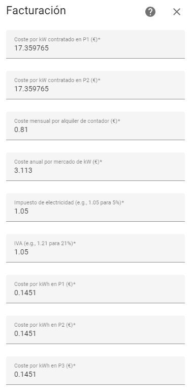
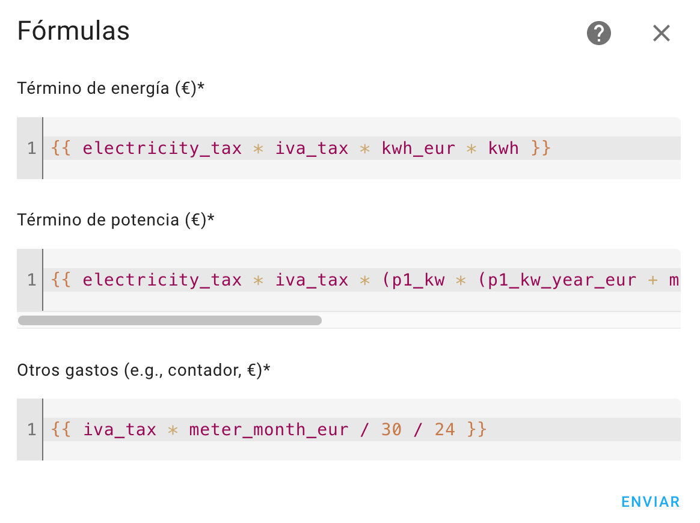
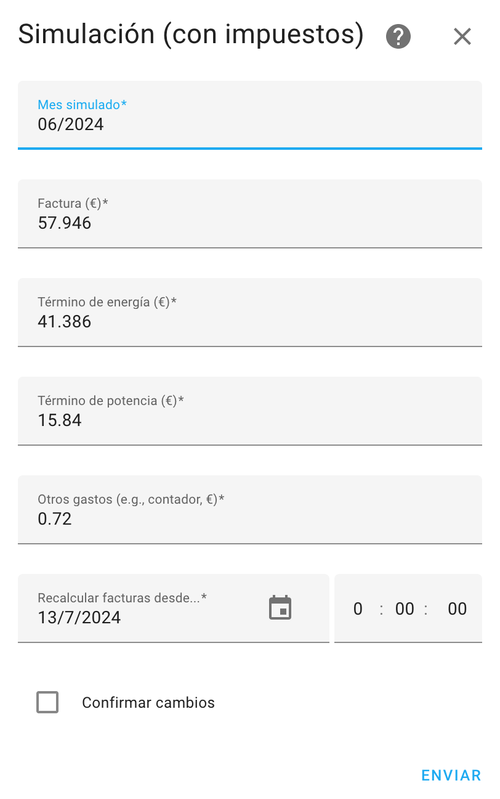
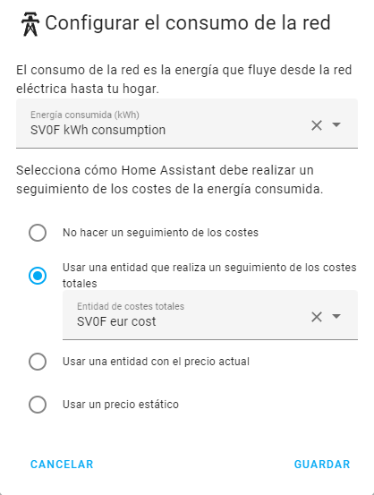
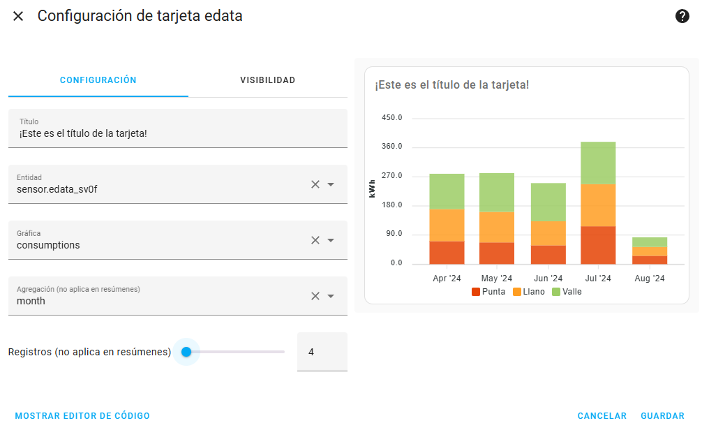

[](https://github.com/custom-components/hacs)

[](https://github.com/uvejota/homeassistant-edata/releases/latest)

# homeassistant-edata


Esta integración para Home Assistant te permite seguir de un vistazo tu consumo, generación y máximas potencias registradas (maxímetro) configurando tu usuario de Datadis.

Para la visualización de los datos, existen varias alternativas:
1. Configurar el Panel de Energía nativo de Home Assistant.
2. Utilizar la tarjeta nativa de esta integración (edata-card). **RECOMENDADO, CONFIGURACIÓN SENCILLA.**
3. Utilizar tarjetas de terceros (e.g., apexcharts-card) que consume los datos de la integración por Websockets. **Para los más cafeteros...**


## Índice de contenidos

1. [Ejemplo de Dashboard](#Ejemplo-de-Dashboard)<br>
2. [Limitaciones](#Limitaciones)<br>
3. [Instalación](#Instalación)<br>
4. [Sensores de la integración](#Sensores-de-la-integración)<br>
5. [Acciones de la integración](#Acciones-de-la-integración)<br>
6. [Integración con panel Energía (Long Term Statistics)](#Integración-con-panel-Energía-Long-Term-Statistics)<br>
7. [Configurar la tarificación](#Configurar-la-tarificación)<br>
8. [Gráficas con tarjeta nativa](#Gráficas-con-tarjeta-nativa)<br>
9. [Gráficas sobre ApexCharts-card](#Gráficas-sobre-apexcharts-card)<br>
10. [Acceso a datos descargados](#Acceso-a-datos-descargados)<br>
11. [FAQ](#FAQ)

## Ejemplo de Dashboard



## Limitaciones

* Los datos mostrados **jamás serán en tiempo real**, ya que se saca de la información que registra/factura tu distribuidora y expone a través de la plataforma Datadis. *Siendo optimistas* obtendrás tus datos con al menos dos días de retraso.
* Las opciones de tarificación para **estimar** la factura, quedan limitadas a tarifas 2.0TD PVPC, o precio fijo con distinción de tres tramos: punta, llano y valle. La tarificación del retorno NO está disponible aún.
* Se depende de la disponibilidad de Datadis, si la API no devuelve datos, no hay NADA que hacer. **Lo que se ve en la Web de Datadis no tiene por qué coincidir con los datos que devuelve la API, son fuentes distintas**

## Instalación

Para instalar esta integración en Home Assistant necesitarás:

* una cuenta funcional (y validada) en la web de [Datadis](https://www.datadis.es)
  * no hay que marcar la casilla de la API al registrar, usaremos la privada que está habilitada por defecto,
* una instalación funcional de Home Assistant (a partir de ahora HA) **2025.11 o posterior**, con los componentes `recorder` y `lovelace` disponibles (lo están por defecto),
* instalar [HACS](https://hacs.xyz/),
* (opcional) instalar el componente [apexchart-card](https://github.com/RomRider/apexcharts-card) (usando HACS) si se quisiera utilizar este método para visualizar los datos.

Una vez satisfecho lo anterior, los pasos a seguir para la instalación son:

1. Añadir este repositorio (<https://github.com/uvejota/homeassistant-edata>) a los repositorios personalizados de HACS,
2. Instalar la integración mediante HACS, y
3. Buscar "edata" en `Configuración > Dispositivos y servicios > Añadir integración`



4. Configurar sus credenciales de Datadis, indicando el NIF autorizado _únicamente si no es el titular del suministro indicado_. A continuación se listará los suministros encontrados para las credenciales introducidas.



5. Esperar unos minutos. Le aparecerá un nuevo dispositivo, que consta de un sensor principal llamado `sensor.edata_xxxx` donde `xxxx` dependerá de los últimos caracteres de su CUPS, y de otros sensores con los datos.

> **NOTA:** La instalación puede tardar bastante en su primera ejecución, ya que la integración descarga el histórico desde el inicio del suministro (como máximo los dos últimos años, que es lo que permite Datadis), y Datadis a veces puede tomarse su tiempo. Después, la integración solicitará únicamente lo que le falta, como mucho una vez cada 24 h.

## Sensores de la integración

La integración ofrece los sensores de la figura. Cada uno de estos sensores dispone de una serie de atributos (al clicar) ampliando la información, por ejemplo indicando qué parte del consumo se ha registrado en P1, P2, y P3, o la fecha del último consumo registrado.



El sensor `sensor.edata_xxxx` es un tanto especial, ya que incluye información relativa al contrato vigente en el CUPS configurado, y su estado indica el último dato descargado de Datadis.

> **NOTA:** Si no ves los datos de ayer, lee el [FAQ](#FAQ)

## Acciones de la integración

Desde la versión 2024.07.5, la integración incorpora las siguientes acciones, accesibles desde el panel del dispositivo edata que desea configurar.

* **Reparar estadísticas de Home Assistant:** Borra las estadísticas de edata en Home Assistant (consumo, coste y maxímetro) y las vuelve a generar a partir de los datos que edata ya tiene guardados. No consulta a Datadis. Útil si las gráficas o el panel de energía muestran huecos, duplicados o valores incoherentes.
* **Forzar sincronización:** Vuelve a pedir a Datadis todo el histórico que tenga disponible (los 2 últimos años) y después repara las estadísticas como el botón anterior. La sincronización automática solo pide lo que falta, como mucho una vez cada 24 h, y Datadis no responde de nuevo a una misma consulta en ese tiempo; como esta consulta es distinta, trae los datos más recientes que tenga Datadis aunque ya se haya sincronizado ese día. Útil si te faltan datos que ya aparecen en Datadis.


## Integración con panel Energía (Long Term Statistics)

La integración combina almacenamiento local (una base de datos SQLite propia), con la base de datos de estadísticas nativa de Home Assistant, lo cual habilita su uso en el panel de energía. Por defecto, las estadísticas generadas serán:

| statistic_id | Tipo | Unidad | Significado |
| ------------- | ------------- | ------------- | ------------- |
| `edata:xxxx_consumption` | `sum` | `kWh` | Consumo total |
| `edata:xxxx_p1_consumption` | `sum` | `kWh` | Consumo en P1 |
| `edata:xxxx_p2_consumption` | `sum` | `kWh` | Consumo en P2 |
| `edata:xxxx_p3_consumption` | `sum` | `kWh` | Consumo en P3 |
| `edata:xxxx_surplus` | `sum` | `kWh` | Excedentes (retorno) total |
| `edata:xxxx_maximeter` | `max` | `kW` | Maxímetro |
| `edata:xxxx_p1_maximeter` | `max` | `kW` | Maxímetro en P1 |
| `edata:xxxx_p2_maximeter` | `max` | `kW` | Maxímetro en P2 |
| `edata:xxxx_cost`*  | `sum` | `€` | Coste total |
| `edata:xxxx_p1_cost`*  | `sum` | `€` | Coste total en P1 |
| `edata:xxxx_p2_cost`*  | `sum` | `€` | Coste total en P2 |
| `edata:xxxx_p3_cost`*  | `sum` | `€` | Coste total en P3 |
| `edata:xxxx_power_cost`*  | `sum` | `€` | Coste (potencia) |
| `edata:xxxx_energy_cost`*  | `sum` | `€` | Coste (energía) |
| `edata:xxxx_p1_energy_cost`*  | `sum` | `€` | Coste (energía) en P1 |
| `edata:xxxx_p2_energy_cost`*  | `sum` | `€` | Coste (energía) en P2 |
| `edata:xxxx_p3_energy_cost`*  | `sum` | `€` | Coste (energía) en P3 |

\* Los campos marcados con asterisco no están habilitados por defecto, y se habilitan como indica el siguiente apartado.

## Configurar la tarificación

Navegue hasta `Ajustes > Dispositivos y Servicios > XXXX (edata) - Configurar`. Primero deberá seleccionar si desea activar o no las funciones de facturación, y en caso de utilizar PVPC seleccionará también dicha casilla.

1. Activar la facturación y/o PVPC.



2. Si no ha activado PVPC, tendrá que configurar los costes asociados a cada término (según su contrato). Introduzca los precios **sin impuestos**: el impuesto eléctrico y el IVA se aplican después en las fórmulas. Cada campo indica sus unidades y cómo convertir el dato si su factura lo da de otra forma (por ejemplo, por días).



3. Personalización de fórmulas con expresiones jinja2. Tendrá que adaptar la fórmula según su tipología de contrato.

Las variables disponibles son las configuradas en el paso anterior y los consumos del periodo a tarificar, pero con los siguientes nombres:
* `electricity_tax`: impuesto a la electricidad (e.g. 1.05 para el 5%)
* `iva_tax`: IVA (e.g., 1.10 para 10%)
* `kwh_eur`: coste del kWh en euros para la hora del consumo (se escoge automáticamente entre p1, p2, y p3; según convenga)
* `kwh`: energía consumida en kWh
* `p1_kw` y `p2_kw`: potencia contratada en P1 y P2 (en kW)
* `p1_kw_year_eur` y `p2_kw_year_eur`: Coste de la potencia por kW en P1 y P2 (en euros y anual)
* `meter_month_eur`: Coste del alquiler del contador en euros al mes

Las variables anteriores pueden usarse para formar expresiones para los siguientes términos: energía, potencia y otros. No olvides contemplar el IVA. Puedes utilizar la que viene por defecto como base.

> **NOTA 1:** ¡Siempre en minúscula!
>
> **NOTA 2:** ¡No elimines las llaves del principio y final!
>
> **NOTA 3:** El retorno o batería virtual aún no está soportado.



4. Simulación del último mes y selección de la fecha de inicio para aplicar nueva tarificación.

Este último paso es para confirmar que hemos confeccionado nuestras fórmulas correctamente. Es un simulador del último mes completo (si estás a mediados de julio, calculará junio), de modo que si se acerca a la de tu factura... ¡Lo has hecho bien!

La simulación indica el **periodo simulado y cuántas horas tienen datos** (por ejemplo, _12/06/2026 – 30/06/2026 (456/720 h)_). Solo se facturan las horas con consumo (y con precio, si usa PVPC), así que si no cubre todas las horas del mes, el importe saldrá por debajo de su factura.

No hay que rellenar nada, sólo visualizar, marcar la fecha desde la cual quieres aplicar los cambios de tarificación, y confirmar.



Una vez configuradas y calculadas (tendrá que esperar un poco), las estadísticas pueden configurarse en el panel de energía en `Ajustes > Paneles de control > Energía > Añadir consumo (Red Eléctrica)`:



> **NOTA:** Esta integración hace un uso _gracioso_ del panel de estadísticas de Home Assistant que, aunque lo permite, no está totalmente preparado para manipular estadísticas a pasado.

## Gráficas con tarjeta nativa

Se ofrecen una serie de tarjetas nativas que facilitan la representación de los datos y pueden configurarse desde la UI de Home Assistant, seleccionando la configuración que desee en el editor.



Las tarjetas disponibles son:
- Gráfica de consumos (`consumptions`), excedente (`surplus`), o facturas (`costs`); agrupados por hora, día o mes. Los consumos y excedentes se desglosan por periodo (punta, llano y valle) y las facturas por término (energía, potencia y otros).
- Gráfica de potencias máximas registradas (`maximeter`)
- Resumen del último día registrado (`summary-last-day`), mes en curso (`summary-month`), o mes pasado (`summary-last-month`).

Adicionalmente, puedes cambiar los colores añadiendo el atributo `colors` al YAML resultante:

```yaml
type: custom:edata-card
...
colors: # opcional, para cambiar los colores
  - '#e54304'
  - '#ff9e22'
  - '#9ccc65'
```

> **NOTA:** en futuras versiones se contempla ampliar y mejorar las funcionalidades de la tarjeta, así como proporcionar traducciones.


## Gráficas sobre ApexCharts-card

A continuación se ofrece la configuración orientativa para **visualizar los datos obtenidos mediante apexcharts-card**, que también debe instalarse manualmente o mediante HACS. Siga las instrucciones de <https://github.com/RomRider/apexcharts-card> y recuerde tener el repositorio a mano para personalizar las gráficas a continuación.

> **IMPORTANTE:** en las siguientes tarjetas deberá reemplazar TODAS las ocurrencias de `xxxx` por sus últimos cuatro caracteres de su CUPS.
>
> **El nombre de las entidades puede ser distinto en su instalación. Revíselo.**

Además, puedes consultar la sección _Discussions_ del repositorio, en el que los usuarios pueden compartir sus configuraciones, por si te gusta alguna.

### Consumo diario


<details>
<summary>He leído las instrucciones y quiero ver el contenido</summary>

``` yaml
type: custom:apexcharts-card
graph_span: 30d
stacked: true
span:
  offset: '-1d'
experimental:
  brush: true
header:
  show: true
  title: Consumo diario
  show_states: false
  colorize_states: false
brush:
  selection_span: 10d
all_series_config:
  type: column
  unit: kWh
  show:
    legend_value: false
series:
  - entity: sensor.edata_xxxx
    name: Total
    type: column
    data_generator: |
      return hass.connection.sendMessagePromise({
      type: 'edata/ws/consumptions',
      scups: 'xxxx',
      aggr: 'day',
      records: 30});
    show:
      in_chart: false
      in_brush: true
  - entity: sensor.edata_xxxx
    name: Punta
    stack_group: "1"
    data_generator: |
      return hass.connection.sendMessagePromise({
      type: 'edata/ws/consumptions',
      scups: 'xxxx',
      aggr: 'day',
      tariff: 1,
      records: 30});
  - entity: sensor.edata_xxxx
    name: Llano
    stack_group: "1"
    data_generator: |
      return hass.connection.sendMessagePromise({
      type: 'edata/ws/consumptions',
      scups: 'xxxx',
      aggr: 'day',
      tariff: 2,
      records: 30});
  - entity: sensor.edata_xxxx
    name: Valle
    stack_group: "1"
    data_generator: |
      return hass.connection.sendMessagePromise({
      type: 'edata/ws/consumptions',
      scups: 'xxxx',
      aggr: 'day',
      tariff: 3,
      records: 30});
```

</details>

### Consumo mensual


<details>
<summary>He leído las instrucciones y quiero ver el contenido</summary>

``` yaml
type: custom:apexcharts-card
graph_span: 395d
stacked: true
yaxis:
  - id: eje
    opposite: false
    max: '|+20|'
    min: ~0
    apex_config:
      forceNiceScale: true
header:
  show: true
  title: Consumo mensual
  show_states: false
  colorize_states: false
all_series_config:
  type: column
  yaxis_id: eje
  unit: kWh
  extend_to: false
  show:
    legend_value: false
series:
  - entity: sensor.edata_xxxx
    type: line
    name: Total
    data_generator: |
      return hass.connection.sendMessagePromise({
      type: 'edata/ws/consumptions',
      scups: 'xxxx',
      aggr: 'month',
      records: 12});
    show:
      in_chart: true
  - entity: sensor.edata_xxxx
    name: Punta
    stack_group: "1"
    data_generator: |
      return hass.connection.sendMessagePromise({
      type: 'edata/ws/consumptions',
      scups: 'xxxx',
      aggr: 'month',
      tariff: 1,
      records: 12});
  - entity: sensor.edata_xxxx
    name: Llano
    stack_group: "1"
    data_generator: |
      return hass.connection.sendMessagePromise({
      type: 'edata/ws/consumptions',
      scups: 'xxxx',
      aggr: 'month',
      tariff: 2,
      records: 12});
  - entity: sensor.edata_xxxx
    name: Valle
    stack_group: "1"
    data_generator: |
      return hass.connection.sendMessagePromise({
      type: 'edata/ws/consumptions',
      scups: 'xxxx',
      aggr: 'month',
      tariff: 3,
      records: 12});
```

</details>

### Maxímetro


<details>
<summary>He leído las instrucciones y quiero ver el contenido</summary>

``` yaml
type: custom:apexcharts-card
graph_span: 1y
span:
  offset: '-15d'
header:
  show: true
  title: Maxímetro
  show_states: false
  colorize_states: false
chart_type: scatter
series:
  - entity: sensor.edata_xxxx
    type: column
    extend_to: false
    name: Punta
    show:
      extremas: true
      datalabels: false
    data_generator: |
      return hass.connection.sendMessagePromise({
      type: 'edata/ws/maximeter',
      tariff: 1,
      scups: 'xxxx'});
  - entity: sensor.edata_xxxx
    type: column
    extend_to: false
    name: Llano y Valle
    show:
      extremas: true
      datalabels: false
    data_generator: |
      return hass.connection.sendMessagePromise({
      type: 'edata/ws/maximeter',
      tariff: 2,
      scups: 'xxxx'});
```

</details>

### Detalle de un día/mes concreto

Para ver el reparto por periodos (punta, llano y valle) del último día, del mes en curso o del mes pasado, junto con el total y el coste, usa la tarjeta nativa con `summary-last-day`, `summary-month` o `summary-last-month` (ver [Gráficas con tarjeta nativa](#Gráficas-con-tarjeta-nativa)).

## Acceso a datos descargados

Los datos descargados se almacenan en:
1. Base de datos de estadísticas de HA (Long Term Statistics)
2. Base de datos SQLite de edata, en `config/.storage/edata.db`

Para acceder a los mismos, puede consumir la propia API de websockets que utilizan las tarjetas, bajo las definiciones a continuación

| **Nombre del WebSocket** | **Descripción** | **Tipo (`type`)** | **Parámetros** |
|--------------------------|-----------------|-------------------|----------------|
| `ws_get_consumptions` | Historial de consumos. | `edata/ws/consumptions` | `scups` (requerido): CUPS abreviado (`xxxx`). <br> `aggr` (opcional, por defecto: `"day"`): agregación (`"hour"`, `"day"` o `"month"`). <br> `records` (opcional, por defecto: 30): número de registros. <br> `tariff` (opcional): periodo (`1`, `2` o `3`). <br> `from_now` (opcional): si es `true`, cuenta los registros hacia atrás desde ahora en lugar de desde el último dato. |
| `ws_get_surplus` | Historial de excedentes. | `edata/ws/surplus` | `scups` (requerido): CUPS abreviado (`xxxx`). <br> `aggr` (opcional, por defecto: `"day"`): agregación (`"hour"`, `"day"` o `"month"`). <br> `records` (opcional, por defecto: 30): número de registros. <br> `tariff` (opcional): periodo (`1`, `2` o `3`). <br> `from_now` (opcional): si es `true`, cuenta los registros hacia atrás desde ahora en lugar de desde el último dato. |
| `ws_get_cost` | Historial de costes. | `edata/ws/costs` | `scups` (requerido): CUPS abreviado (`xxxx`). <br> `aggr` (opcional, por defecto: `"day"`): agregación (`"hour"`, `"day"` o `"month"`). <br> `records` (opcional, por defecto: 30): número de registros. <br> `term` (opcional): término de la factura (`"energy"`, `"power"` u `"others"`); los tres suman el total. <br> `from_now` (opcional): si es `true`, cuenta los registros hacia atrás desde ahora en lugar de desde el último dato. |
| `ws_get_maximeter` | Historial del maxímetro. | `edata/ws/maximeter` | `scups` (requerido): CUPS abreviado (`xxxx`). <br> `tariff` (opcional): periodo (`1` o `2`). |
| `ws_get_summary` | Resumen (atributos). | `edata/ws/summary` | `scups` (requerido): CUPS abreviado (`xxxx`). |

Todos devuelven una lista de pares `[marca de tiempo en ms, valor]`, salvo `edata/ws/summary`, que devuelve un diccionario con los atributos.

## FAQ

**No me llegan datos nuevos, o llevan días sin actualizarse**

> edata solo puede mostrar lo que le devuelve la API de Datadis, y eso depende mucho de tu distribuidora. Lo normal es ir uno o dos días por detrás, pero a veces la API deja de servir datos durante días o incluso semanas (algunas distribuidoras solo los vuelcan al cerrar el ciclo de facturación), y luego llegan todos de golpe sin que hagas nada.
>
> Si en el log de edata no hay errores, no es un fallo de la integración: simplemente Datadis no está dando datos. Ten en cuenta que lo que ves en la web de Datadis no tiene por qué coincidir con lo que devuelve su API, son fuentes distintas. Si se alarga mucho, puedes escribir a Datadis desde el formulario de contacto de su web.

**Los datos ya aparecen en Datadis, pero no en edata**

> Datadis solo permite repetir la misma consulta una vez cada 24 h, así que edata sincroniza como mucho una vez al día. Si a tu instalación le toca a las 17 h y tu distribuidora sube los datos a las 19 h, no los verás hasta el día siguiente.
>
> Si no quieres esperar, pulsa _Forzar sincronización_ en el dispositivo de edata: vuelve a pedir todo el histórico disponible, que es una consulta distinta, y trae lo último que tenga Datadis. Solo funciona una vez al día.

**¿Sirve de algo reiniciar Home Assistant o borrar la caché?**

> No, y suele empeorarlo. Datadis rechaza con un error 429 las consultas repetidas en menos de 24 h, y edata guarda sus respuestas precisamente para no repetirlas. Reiniciar no adelanta nada, y borrar `.storage/edata_cache` solo provoca más errores 429. Deja que la integración pida lo que le falta.

**Error de credenciales, o no encuentra mi suministro**

> - El usuario y la contraseña son los mismos con los que entras en la web de Datadis. Comprueba que funcionan allí, porque la contraseña caduca.
> - Deja vacío el _NIF autorizado_ salvo que el suministro sea de otro titular que te lo haya autorizado en Datadis. Si eres el titular y lo rellenas, fallará.
> - Copia el CUPS completo desde _Mis suministros_ en la web de Datadis, incluidos los dos últimos caracteres (por ejemplo, `0F`).
> - Si acabas de dar de alta el suministro o la cuenta, puede tardar en aparecer en Datadis. Hasta que no salga allí, no hay nada que hacer.
> - No hace falta marcar la casilla de la API al registrarte; edata usa la privada, que tienen todas las cuentas.

**He cambiado de contrato o de comercializadora y he dejado de recibir datos**

> La API de Datadis no devuelve los datos del mes en que cambia el contrato; suelen aparecer al mes siguiente. Si tu distribuidora registró mal la fecha de alta del suministro, tendrás que reclamárselo a ella.

**La tarjeta no muestra nada**

> - Si usas apexcharts-card, cambia todas las `xxxx` por los últimos cuatro caracteres de tu CUPS.
> - Después de actualizar edata, recarga el navegador sin caché (Ctrl+F5 o equivalente).
> - Comprueba que ningún bloqueador de anuncios o de scripts está bloqueando la tarjeta.

**¿Cómo configuro el panel de energía?**

> En _Consumo de la red_ elige `edata:xxxx_consumption` y, si tienes placas, añade `edata:xxxx_surplus` en _Retorno a la red_. Para el coste, si tienes la facturación activada, marca _Usar una entidad que registra el coste total_ y elige `edata:xxxx_cost`, que está en €, no en kWh. No añadas otros dispositivos de tu casa como consumo de la red, o se sumarán dos veces.

**Veo datos inconsistentes, huecos, o el panel de energía no muestra lo mismo que las tarjetas**

> Usa el botón _Reparar estadísticas de Home Assistant_ del dispositivo de edata. Borra las estadísticas de edata en Home Assistant y las regenera a partir de los datos que edata tiene guardados, sin consultar a Datadis ni modificar esos datos.

**Hay una hora de desfase con los datos de Datadis**

> Es una diferencia de criterio: Datadis apunta el consumo al final de cada hora y Home Assistant al principio. El consumo de 00:00 a 01:00 aparece a la 01:00 en Datadis y a las 00:00 en Home Assistant.

**No puedo instalarla**

> - edata se instala desde HACS (repositorio personalizado), no desde _Complementos_.
> - Se configura desde la interfaz; la configuración por YAML ya no existe.
> - Necesitas Home Assistant 2025.11 o posterior y el componente `recorder` activo.
> - Si falla al descargar dependencias, suele ser un problema de red o DNS, por ejemplo un filtro del router o del operador que bloquea PyPI.

**Nada de lo anterior soluciona mi problema**

> Comprueba primero que tienes la última versión de edata. Si es así, activa _Activar depuración_ en las opciones de la integración, espera a la siguiente sincronización (o pulsa _Forzar sincronización_) y abre una _issue_ con el log y la descripción del problema. Antes, echa un vistazo a las _issues_ por si alguien tiene el mismo problema.